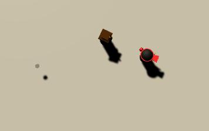

# **Top Down Ninja**

In this project I will be looking to make a simple 3D and *unique* top down shooter type game using the engine Unity. I will be coding the game Using C# and will also be using many of unity's properties to help make the game. The game will be of a Ninja that has too take down multiple Mall cops using just their skills and weaponry. 

## Why did I choose this to do?

I chose to do Unity as my project because of a few reasons:
* 1. This would have me learn an entirely new coding language which would push myself into learning more.
* 2. I have never worked in the third dimension in coding before so this would broaden my reach of what I can do.
* 3. I have never used unity before and wanted to learn how to use it to help myself in the future.

## A demo of My project

My project is currently **Unfinished** and is in a general working state, but I am able to move at a fast pace when it comes to it and am almost complete with my roadmap of where I thought I would be at this point. 

Here we have my main character (The one in red) being chased by the enemy (The one in blue). Currently the enemy only chases the player, and has no advanced ai of any kind. 

Here is an outer look at the same scene. Currently the room is just a simple box. Here we also get a glimpse at howthe camera works. As you can see, from the camera there shoots out a blue line that hits the ground. That line is how the player is able to "see" where the mouse is. We have the camera shoot a "ray" down to the mouse position, then have the character turn to look at that ray. 

Here the main character is throwing a prototype Shurukin (Throwing star). This is the weapon the character uses mainly for now. It's a bit hard to see but you can see its shadow. The shurukin damages the enemy, and 5 shurukin hits will defeat an enemy. 

## What tech did I use?

The only tech that was used in making this was the Unity program itself, and a program called Microsoft Visual Studio which let me write code in C# directly to unity. 

## What sources did you use to help you?

This series helped me out with the camera and how to make models. [Github](https://www.youtube.com/watch?v=lkDGk3TjsIE&list=PLiyfvmtjWC_XBKJVuCtMXrkNnMDNB16W9&index=1&ab_channel=gamesplusjamesgamesplusjames)
